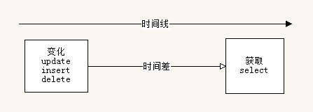

PHP进阶之数据库设计
=======

##第五节 常见的缓存字段设计（空间换时间）  

**引言**

我们经常会遇到这样一个需求：

1. 某个图书分类下的图书浏览总数、购买总数
2. 某个用户的总下载量
3. 某些复杂的统计需要，比如平均值、加权值等

这些数据如果理论上可以直接从数据库直接计算，但是计算时间和数据库压力会随着数据量的增加而变大。面对这样的需求，有什么好的办法解决？

**以上次的一个题目继续话题**

做一个关于图书的项目，其中有：  

1. 书（book）
2. 分类（class）

每本书都会一个点击量，那么，我想知道某个分类下的所有图书的点击量总和和平均值。

对于上面的需求，我们应该如何做？

**同学的方法**

**1. 直接查**

>> select sum(click_num) as total_num, avg(click_num) as avg_num from ...;

优点：计算实时，方便；  
缺点：如果where 后面区分度小，选出的条数太多，则造成设计的条数过多，引起数据库压力。

**2. 缓存字段**

我们会讲这个数据存放在一个地方（数据库、内存缓存），然后直接读取即可。这里我们以数据库为例，那么我们的class需要增加的字段是：

>> alter table class add total\_num int unsigned not null default 0, add avg\_num int unsigned not null default 0;

然后，查询的时候，直接查即可。

优点：查询速度快
缺点：需要数据进行维护。

**设计思路**

我们的数据会有一个流，从哪里来，到哪里去，从哪里开始变化，变化后到哪里。这里，就是一个很好的例子，我们关注数据如何变化以及何时变化，那么，我们可以在需要的时候实时计算，也可以在变化的时候实时算好，当然也可以再变化到取数据的中间，来生成。

**需要考虑的问题**

缓存字段很容易实现，但是有个问题不可避免，那就是总需要有个地方来计算这个总数。那么如何做统计？

a. 实时更新  
b. 定时统计

**问答**
