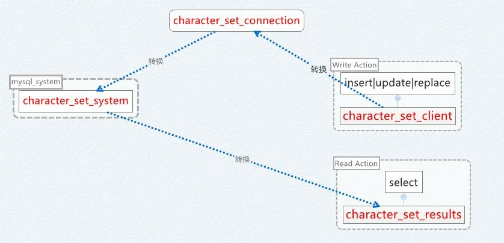

PHP进阶之数据库设计
=======

##第四节 字符集的处理  

**字符集是什么**

每一个“字”的本质是一个二进制的机器码，字符集来将这种字符集解释为我们可以识别的文字。自然世界中，存在“GBK”、“UTF8”、“Latin1”等。

字符集不仅存在于mysql里，同样，在PHP的世界里也存在。这包括：PHP文件本身的编码、输出编码、浏览器解释的编码。这中间有一环不一致，则会造成我们经常遇到的显示乱码的问题。

**mysql的字符集**

首先，我们来看看哪些地方会涉及到mysql的字符集。

>> show variables like 'character%';
 
>> character\_set\_client 客户端字符集  
>> character\_set\_connection 连接字符集  
>> character\_set\_database 数据库默认字符集  
>> character\_set\_filesystem 文件系统使用字符集  
>> character\_set\_results 结果返回的字符集  
>> character\_set\_server 服务器字符集  
>> character\_set\_system 存储系统使用的字符集

我们来看一张图，看看我们描述的字符集的使用地方：

在设置了这些字符集后，mysql会根据系统字符集、表字段字符集、传输字符集来进行编码转化，最终输出的是按指定的字符集来输出。这样，你可以对字符集有更多的控制。

**案例**

我们将mysql的数据库设置为gbk的，然后通过utf8的方式来获取数据，并且保证不出现乱码。

>> create table charset (t varchar(30) CHARACTER SET gbk);  
>	insert into charset values ('中文');

然后，通过UTF-8的脚本来读取：

>> <?php  
>> //include '../shadow/Shadow.php';  
>> //文件是UTF-8编码的     
>> $db = new mysqli('127.0.0.1', 'root', '', 'lesson', 3306);  
>> $db->set_charset('UTF8');  
>> $ret = getResult('show variables like "character%"', $db);
>> print_r($ret);  
>>   
>> $ret = getResult('select * from charset', $db);  
>> print_r($ret);  
>>   
>> function getResult($sql, $db){  
>> $query = $db->query($sql);  
>> 	if(empty($query)){  
>> 		echo $db->error;  
>> 		return false;  
>> 	}  
>> 	$ret = array();  
>> 	while($row = $query->fetch_assoc()){  
>> 		$ret[] = $row;  
>> 	}  
>> 	return $ret;  
>> }  

**问答**

1. 全设为utf8合理不？  
	答：字符集是从小到大转，可行（gbk->utf8）；反之，有损；